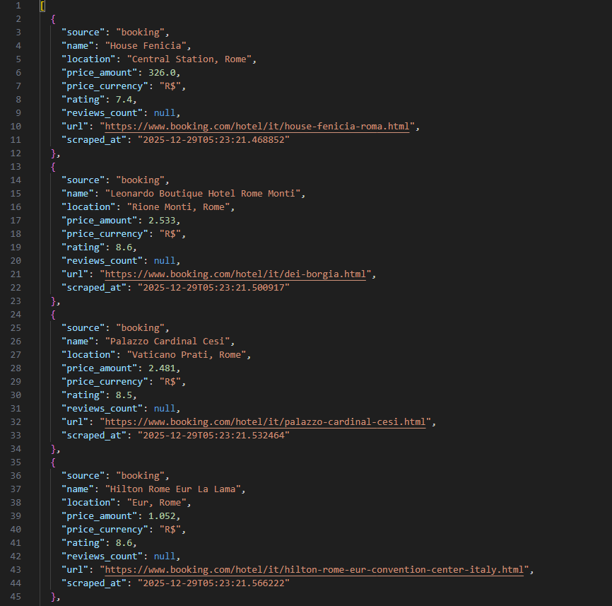

# Project: Booking + Hotels.com Scraper



## Description:
-----------
This project automates the collection of hotel data for specific destinations using two approaches:
1. Booking.com via Selenium (page navigation and scraping).
2. Hotels.com via API (with automatic internal API discovery attempt).

## Objective:
-----------
- Collect hotel information (name, price, address, reviews, etc.) for analysis, research, or personal applications.
- Test robust scraping strategies against site blocks or changes.

## Project Structure:
---------------------
app/

│
├── main.py                # Main script to run the scraping

├── utils.py               # Helper functions, such as saving JSON

├── scrapers/

|   ├── __init__.py        # Marks the folder as a Python package

│   ├── booking.py         # Booking.com scraping logic via Selenium

│   ├── hotels.py          # Hotels.com scraper via API

│   ├── api_probe.py       # Tests if Hotels.com API is accessible

│   ├── api_discovery.py   # Discovers Hotels.com API in real-time

│   └── config.py          # Settings and constants (URLs, headers, payloads)

└── data/                  # Folder to save results and screenshots

## Dependencies:
--------------
- Python 3.14+
- Selenium
- Docker (to run standalone Firefox containers)
- Requests
- Firefox (via Selenium container)

## Initial Setup:
---------------
1. Clone the repository:
   git clone <your_repository_url>
2. Enter the project folder:
   cd Booking_Scraping
3. Build the Docker image:
   docker compose build
4. Install dependencies (optional if running inside the container):
   pip install -r requirements.txt

## Usage:
-----
To run the scraping, execute the command below inside the project:

### Scraping for the city "Rome"

```bash
docker compose down --volumes --remove-orphans
docker compose build --no-cache
docker compose run scraper Roma
```

## Results:

Final data will be saved in app/data/results.json.

Screenshots of captchas or blocks will be saved in app/data/.

## Notes:

-Booking.com is scraped via Selenium, making the process slower but reliable.
-Hotels.com uses an internal API that may change or block bots. The project attempts to discover the API, but blocks or changes may prevent scraping.
-For future development: integrate api_probe and api_discovery more robustly to handle Hotels.com API changes.
-The ENABLE_HOTELS variable in config.py allows enabling or disabling Hotels.com scraping.

## License:

Personal use. Modify and adapt as you wish. Not responsible for commercial use or violation of site terms.

@@@@@@@@@@@@@@@@@@@@@@@@@@@@@@@@@@@@@@@@@@@@@@@@@@@@@@@@@@@@@@@@@@@@@@@@@@@@@@@@@@@@@@@@@@@@@@@@@@@@@@@@@@@@@@@@@@@@@@@@@@@@@@@@@@@@@@@@@@@@@@@@@@@@@@@@@

## portuguese
# Projeto: Booking + Hotels.com Scraper

## Descrição:
-----------
Este projeto automatiza a coleta de dados de hotéis para destinos específicos usando duas abordagens:
1. Booking.com via Selenium (navegação e scraping de páginas).
2. Hotels.com via API (com tentativa de descoberta automática da API interna).

## Objetivo:
-----------
- Coletar informações de hotéis (nome, preço, endereço, avaliações etc.) para análises, pesquisas ou aplicações pessoais.
- Testar estratégias de scraping robustas frente a bloqueios ou mudanças em sites.

## Estrutura do Projeto:
---------------------
app/

│

├── main.py                # Script principal para rodar o scraping

├── utils.py               # Funções auxiliares, como salvar JSON

├── scrapers/

|   ├── __init __.py        # Marca a pasta como pacote Python

│   ├── booking.py         # Lógica de scraping do Booking.com via Selenium

│   ├── hotels.py          # Scraper do Hotels.com via API

│   ├── api_probe.py       # Testa se a API do Hotels.com está acessível

│   ├── api_discovery.py   # Descobre a API do Hotels.com em tempo real

│   └── config.py          # Configurações e constantes (URLs, headers, payloads)

└── data/                  # Pasta para salvar resultados e screenshots

## Dependências:
--------------
- Python 3.14+
- Selenium
- Docker (para rodar containers standalone com Firefox)
- Requests
- Firefox (via container Selenium)

## Setup Inicial:
---------------
1. Clone o repositório:
   git clone <seu_repositorio_url>
2. Entre na pasta do projeto:
   cd Booking_Scraping
3. Construa a imagem Docker:
   docker compose build
4. Instale dependências (opcional se rodar dentro do container):
   pip install -r requirements.txt

## Uso:
-----
Para rodar o scraping, execute o comando abaixo dentro do projeto:

### Scraping para a cidade "Roma"

```bash
docker compose down --volumes --remove-orphans
docker compose build --no-cache
docker compose run scraper Roma
```

##Resultados:
------------
- Dados finais serão salvos em `app/data/results.json`.
- Screenshots de captchas ou bloqueios serão salvos em `app/data/`.

##Notas:
-------
- Booking.com é raspado via Selenium, por isso o processo é mais lento, mas confiável.
- Hotels.com usa uma API interna que pode mudar ou bloquear bots. O projeto tenta descobrir a API, mas bloqueios ou mudanças podem impedir o scraping.
- Para desenvolvimento futuro: integrar `api_probe` e `api_discovery` de forma mais robusta para lidar com mudanças na API do Hotels.com.
- Variável `ENABLE_HOTELS` em `config.py` permite ativar ou desativar o scraping do Hotels.com.

###Licença:
---------
Uso pessoal. Modifique e adapte como desejar. Não se responsabiliza por uso comercial ou violação de termos de sites.
